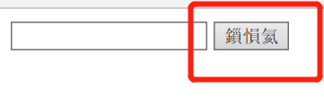
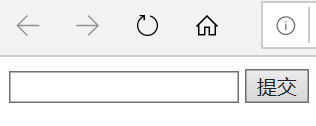
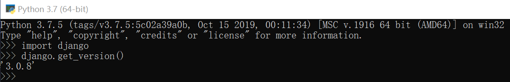
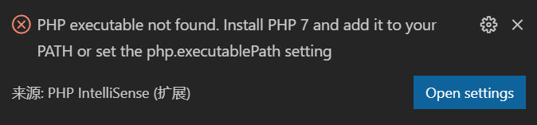
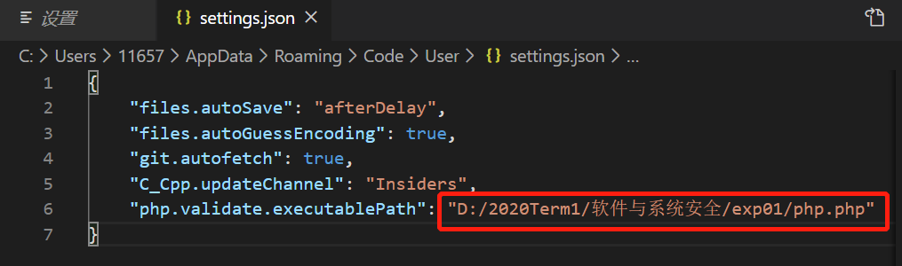
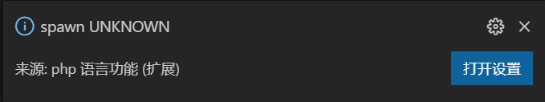

# XSS小实验

## 实验目的

实现一个最简单的xss攻击。

## 实验步骤

#### 一、编写 html 文件

先新建一个 html 文件，代码如下：

```html
`<html>`
`<body>`
<form method="post">
        <input type="text">
        <button>提交</button>
      </form>
`</body>`
`</html>`
```

若出现网页显示为乱码，解决方法是在将 txt 文件另存为 html 文件时，勾选编码方式为<u>带有BOM的UTF-8</u>即可。



正确的网页显示如下：



#### 二、在 VS code 中编写 PHP 脚本

先在 VS code 中添加 php 扩展。

然后编写一个简单的 php 脚本如下：

```php
<!DOCTYPE html> 
<html> 
<body> 

<?php 
echo "Hello World!"; 
?> 

</body> 
</html>
```

调试运行该脚本，提示要先安装 Django。安装后查看版本如下：



在 VS code 中打开 php 文件，却显示如下报错：



打开设置，并将该 php 文件的路径添加进去：



此时报错消失，但新出现一个警告：



忽略这个警告好像也可以调试运行，但是打开自己编写的网页后并没出现什么变化。

此问题待解决。