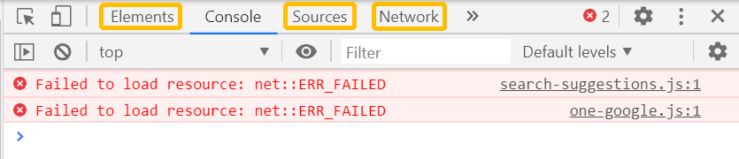
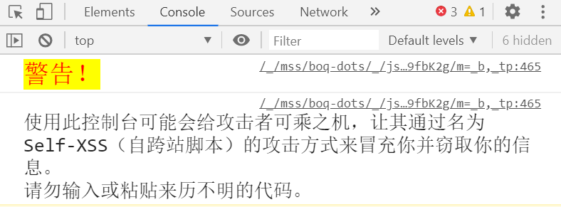
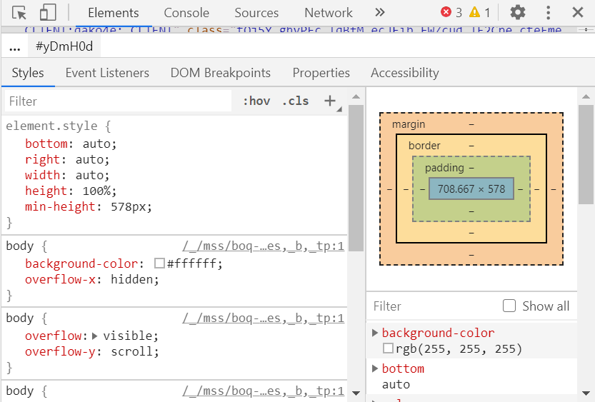
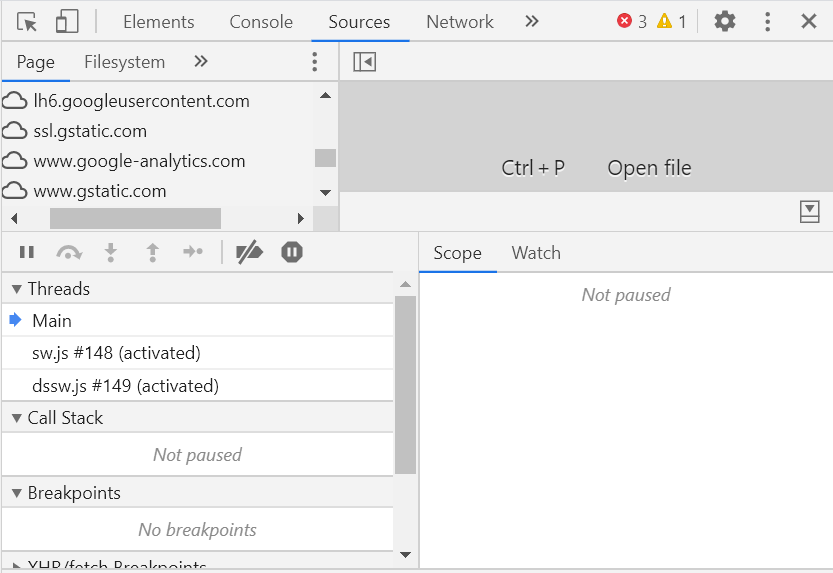
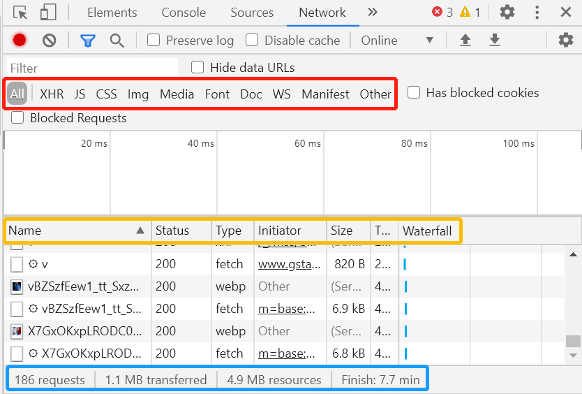

# SQL 注入

## 实验目的

- [ ] 一：用抓包器抓取 web 访问过程中的数据包，并分析 request and response 数据包格式；
- [x] 二：用 chrome 的开发者工具分析网页；
- [ ] 三：在不使用 Django 的情况下，使用 python 的 sqlite 库编写两个页面。

## 实验步骤

### 一、抓包并分析

由于我的 wireshark 出现故障，每次一启动，电脑都会死机，所以这部分暂时不做。

### 二、分析网页

分析时主要用到以下几种工具，均已标黄：

访问`谷歌新闻`，出现如下警告：

使用 `elements` 查看该网页：

可以发现，此处显示的是网页的视觉效果，比如底色、按钮、高度等。

再使用 `sources` 查看网页：

显示了很多以 **.com** 结尾的网址，这应该是该网页的图片和文字来源。

最后用 `network` 查看本网页：

红框里可以选择要查看的数据类型，如 JS，CSS，图片等；

黄框里显示所有数据的名称、状态码、类型、数据大小等，在这里单击鼠标右键还可以选择查看更多信息，如使用的协议、cookies、url 等。

蓝框里是对数据量的统计，一共有186个请求，1.1MB的数据传输，4.9MB的资源量，需要7.7分钟传输完毕。

### 三、用 sqlite 库编写页面